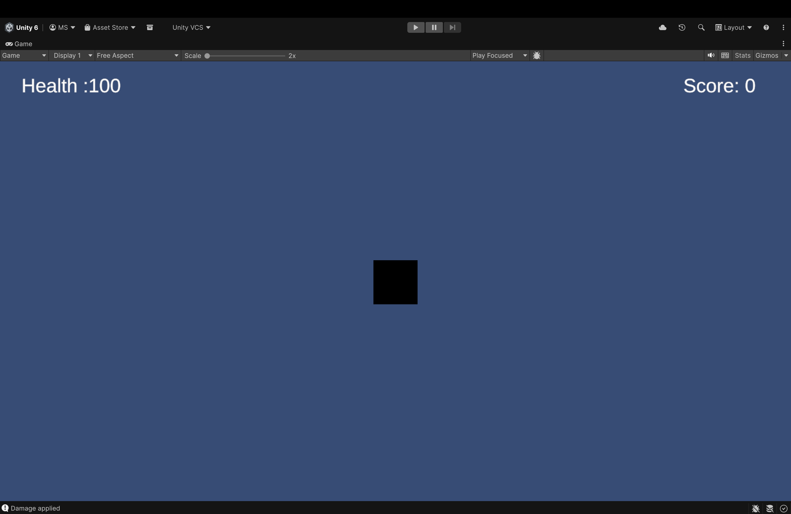
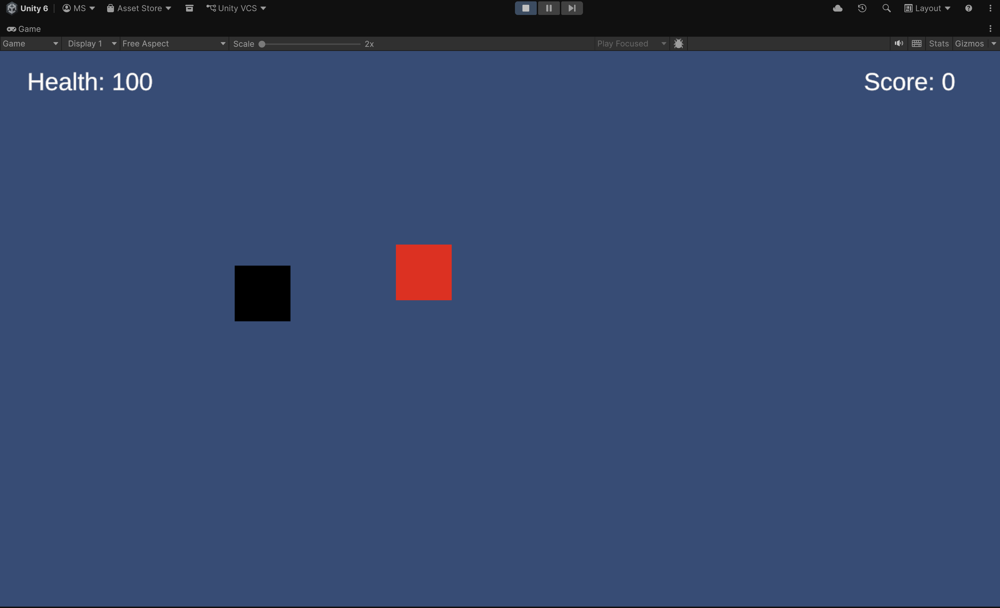
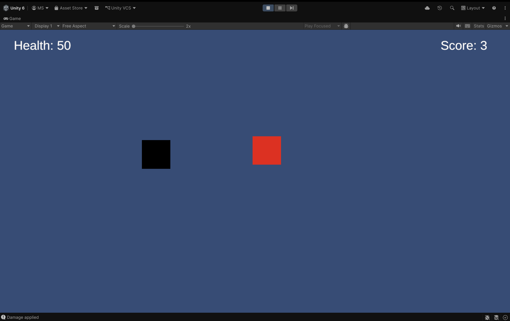

# Basic RPG – Unity Game

##  Description
A simple 2D RPG game where the player can move, attack enemies, manage health, and score points by defeating enemies.

## Engine Used
- Unity (2D)

## Features
- Player movement (WASD / Arrow keys)
- Player health system
- Enemy with health
- Combat system (melee attack using SPACE)
- Enemy defeat and respawn
- Score system
- Player death and game restart
- Basic UI (Health & Score)

## Controls
- **Move** → W / A / S / D or Arrow Keys  
- **Attack** → Spacebar  

## Screenshots

### Gameplay

### UI

## What I Learned
- Player movement using Rigidbody2D  
- Collision detection and combat systems  
- Health and damage handling  
- Working with prefabs and spawning  
- UI updates using TextMeshPro  
- Debugging errors like NullReferenceException  

## Challenges Faced
- Fixing enemy not taking damage  
- Handling prefab references (GameManager issue)  
- Preventing continuous collision damage  
- Implementing enemy respawn system  

## Future Improvements
- Enemy AI (chasing player)  
- Health bars instead of text  
- Sound effects and background music  
- Level system / XP  
